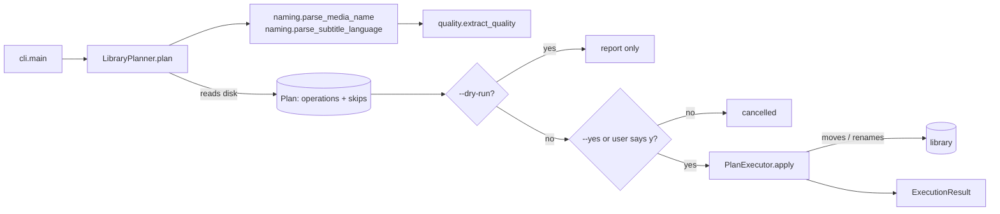

# Architecture

`organize-films` is a small stdlib-only CLI built around one idea: **plan
first, apply second**. The whole library is read once into an immutable
list of operations; that list is either shown (dry run) or executed. See
[naming-convention.md](naming-convention.md) for *what* the plan enforces —
this file is about *how*.

## Pipeline



## Modules

| Module              | Responsibility                                                                           | Touches disk?             |
| ------------------- | ---------------------------------------------------------------------------------------- | ------------------------- |
| `cli.py`            | argument parsing, confirmation prompt, exit codes                                        | no                        |
| `logging_config.py` | console handler + JSONL file handler, default log path                                   | writes the log only       |
| `constants.py`      | extensions, language codes and aliases, reserved folder names                            | no                        |
| `quality.py`        | quality token vocabulary and `extract_quality()`                                         | no                        |
| `naming.py`         | `FilmIdentity` (owns canonical names), `parse_media_name()`, `parse_subtitle_language()` | no                        |
| `operations.py`     | `FileOperation`, `Skip`, `SkipReason` value objects and the `Plan` that collects them    | reads only (`exists()`)   |
| `planner.py`        | `LibraryPlanner`: walks the tree and fills a `Plan`                                      | reads only                |
| `executor.py`       | `PlanExecutor`: applies a `Plan`, returns an `ExecutionResult`                           | **yes** — the only writer |

## Key decisions

### Plan/execute split instead of a `dry_run` flag

The first version threaded a `dry_run: bool` through every method and
mutated the tree while still iterating over a snapshot of it — a loose
file moved into a new folder was then re-visited as a "folder" and
produced a spurious error. Separating a read-only planner from a writer
removes both the flag and the stale-snapshot class of bugs: the dry run
*is* the planner's output, and the executor never has to re-decide anything.

### Bottom-up ordering, current paths

Inside a film folder, every operation is recorded **before** the folder's
own rename and refers to the folder's *current* path. No operation
therefore depends on a previous one having succeeded, and a failed folder
rename leaves the already-renamed contents perfectly valid where they are.
Loose files at the library root are handled before folders, so a stray
video can join an existing canonical folder instead of competing with it.

### Collisions are decided at plan time

`Plan.add()` claims each destination (case-insensitively on Windows,
including ancestor/descendant paths) and checks the disk. A second entry
aiming at a claimed or existing destination becomes a `Skip` visible in
the preview rather than an error discovered halfway through applying.
The executor re-checks `exists()` right before each move as a last guard.

### Never delete, never overwrite

`PlanExecutor` only calls `Path.rename` on a destination it has just
verified to be free, and creates parent folders on demand. It deliberately
avoids `shutil.move`: when a source is locked (a file still being
downloaded, for instance) `shutil.move` falls back to copy + delete, the
delete fails, and a multi-gigabyte duplicate is left behind — observed on
the very first real run. A rename is atomic on a single volume: it either
happens or it does not. There is no code path that removes a file; a
failed operation is reported and the source stays in place.

### Log location

The command is installed globally and run from anywhere, so the log
cannot live "next to the script". It goes to a per-user state directory
(`%LOCALAPPDATA%\organize-films\logs\` on Windows, `$XDG_STATE_HOME` or
`~/.local/state/organize-films/` elsewhere), printed at the end of each
run and overridable with `--log-file`. The file is JSONL (`ts, level, module, msg, ctx`) so a run can be filtered with `jq` without reading it
all; the console gets the human-readable `msg` only.

## Testing

`tests/test_naming.py` is parametrized over the real release names of the
library this tool was written for — it is the regression net for any
change to the parsing heuristics. `tests/conftest.py` provides
`build_library`, which materializes a fake tree from a list of relative
paths (trailing `/` = folder) so planner, executor and CLI tests run on a
real filesystem inside `tmp_path`.

```bash
uv run pytest            # full suite with coverage (threshold 80 %)
uv run pytest -k naming  # one area
```
